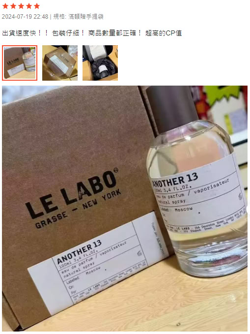
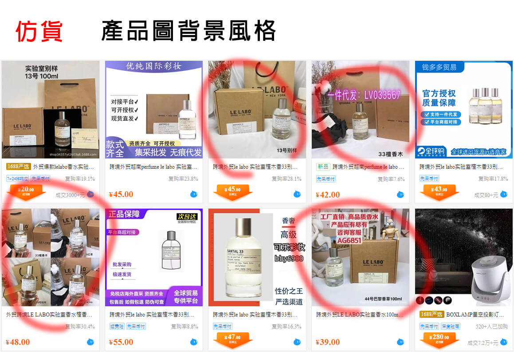

# 通用規則

--8<-- "refs.md"
--8<-- "header_warning.md"

## 保護自己

!!! warning "注意"
    貴重物品開箱務必全程錄影！

如果認為是仿貨，可在錄影中拍下用簽字筆在商品的接縫處簽名，
起到類似「[騎縫章](https://zh.wikipedia.org/zh-tw/%E9%AA%91%E7%BC%9D%E7%AB%A0)」的作用。
事後可用來證明商品沒有被自己掉包，確實是當初開箱的那個。或是如果產品有獨一無二的序號，也可以讓開箱攝影拍下它。

## 賣場相關

比較可能有問題的點：

- 聽過有些賣場會正貨仿貨混著出貨，無解。
- 用賣場的評價分數排序功能，直接看最低分評價，是否有人反應相關問題。
- 二手商品或現貨，但卻不願意提供實物的「細節」照片。
  （不過賣家也有可能用正貨的照片，然後出貨用仿貨）
- 用奇怪的理由來解釋其低廉的價格。例如：員工流出、源頭工廠流出、尾單、瑕疵貨。
- 不敢提是不是正貨，問了也不正面回答。「是」或「不是」選一個就可以了，沒那麼難，不用扯一堆有的沒的。
- 若曾經賣過仿貨，很可能整個賣場都是仿貨。
- 用字遣詞並非台灣的習慣，建議直接避開。
  例如：`親`、`贊`（繁簡轉換錯誤，應為`讚`）、`咨詢`（繁簡轉換錯誤，應為`諮`）、`賬號`（台灣用法為`帳`）、`寶寶`、`麼麼哒`。
- 「主動」提起「不滿意的話可以無條件退貨」。
  這樣的賣家有可能是知道自己在賣仿貨，但不想被拆穿而收到負評（沒看到負評有可能是因為他們都退貨了）。
  依我自己當賣家的想法，我寧願您不要下單，也不要下單用過後退貨（開封即掉價）。
- 觀察商品賣出（評價）的時間是否集中在某幾天，是的話不建議買，[評價非常可能是洗出來的](https://tw.shp.ee/3iCiJT7)。
- 觀察有附上照片的買家評價。
  很多買家其實沒做過功課，並不知道自己買到的是仿貨，但有時候能從他們拍的照片看出來。
  例如下圖買到仿貨還誇包裝仔細態度很好給 5 星評價。

    !!! info "備註"
        Le Labo 正貨不會有塑膠包膜；而標籤地點 Moscow 是最常見的仿貨特徵。

    

## 絕對定價

您要知道您所購買的香型的官方定價大概是多少。
若賣家的大部分商品以官方定價的三分之一，甚至更低的售價販售那幾乎是不可能的（二手的話看貨況）。
請把成交手續費一起納入考量，蝦皮購物目前是 7.5% 起跳，旋轉拍賣是 2.5% 。

## 商品背景圖

背景圖一般來說和是不是正貨無關。不過如果和仿貨工廠用相似的圖片，那我建議買之前再想想 🤔

在 1688 上搜尋仿貨關鍵字（例如：`越南`、`跨境`、`外贸`、`原单`），可以找到一瓶新台幣 200 不到的仿貨。
有些賣家甚至會拿這些仿貨當正貨賣，所以看價格其實不準，購證及品牌提袋比起香水也更容易仿冒。

他們很愛用這種背景放兩隻假人，或是乾花插在花瓶裡的這種照片。

## 真瓶假香

少數不良賣家會收購正貨香水用完後的空瓶，然後灌入假香來販售。

大部分正裝香水用的是一次性封口瓶，撬開勢必會留下痕跡，不過賣家當然也不會拍給你看。
所以理論上，真瓶假香在網購時是無解的，畢竟聞不到味道。
