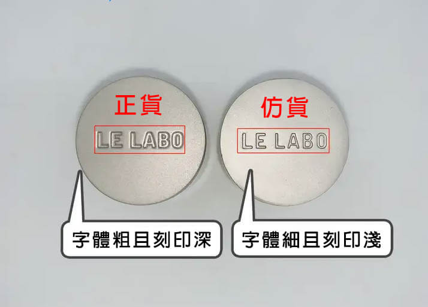
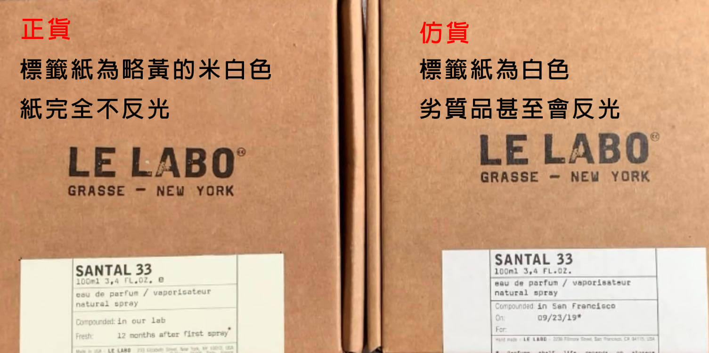
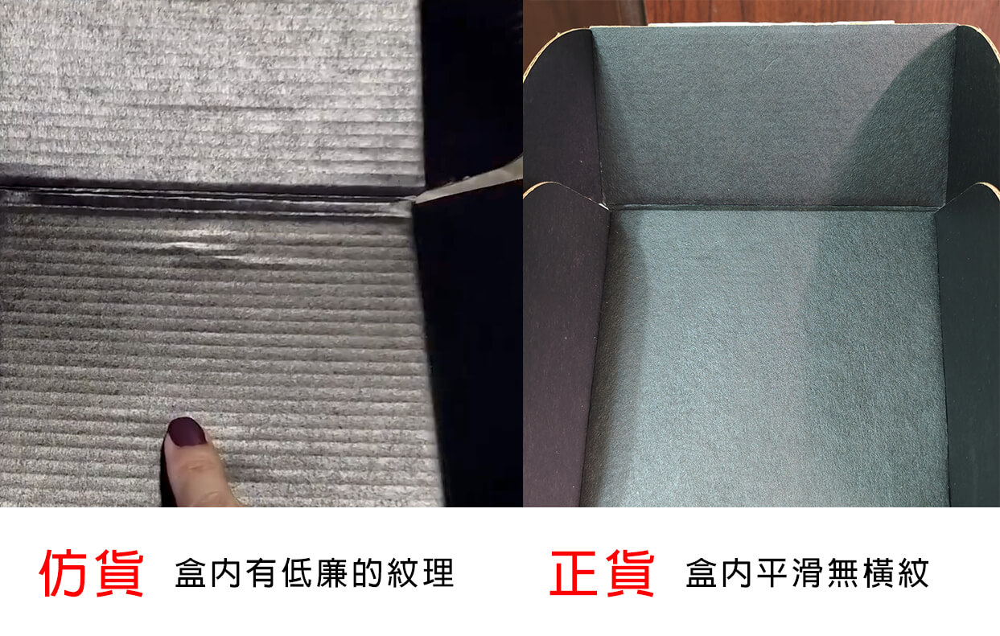
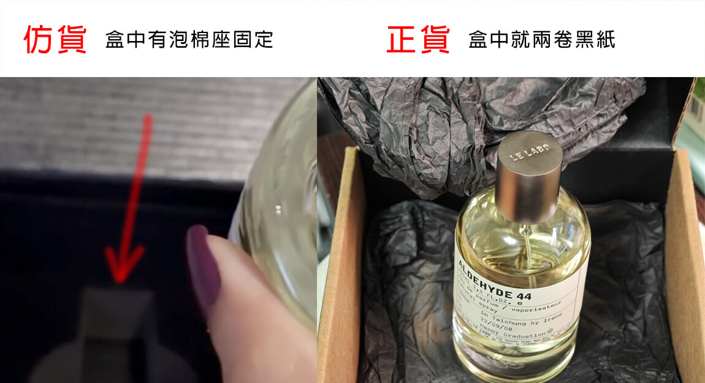
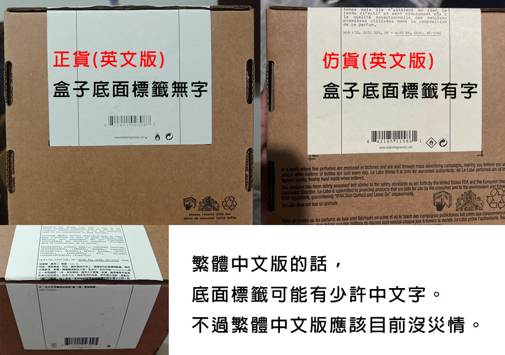
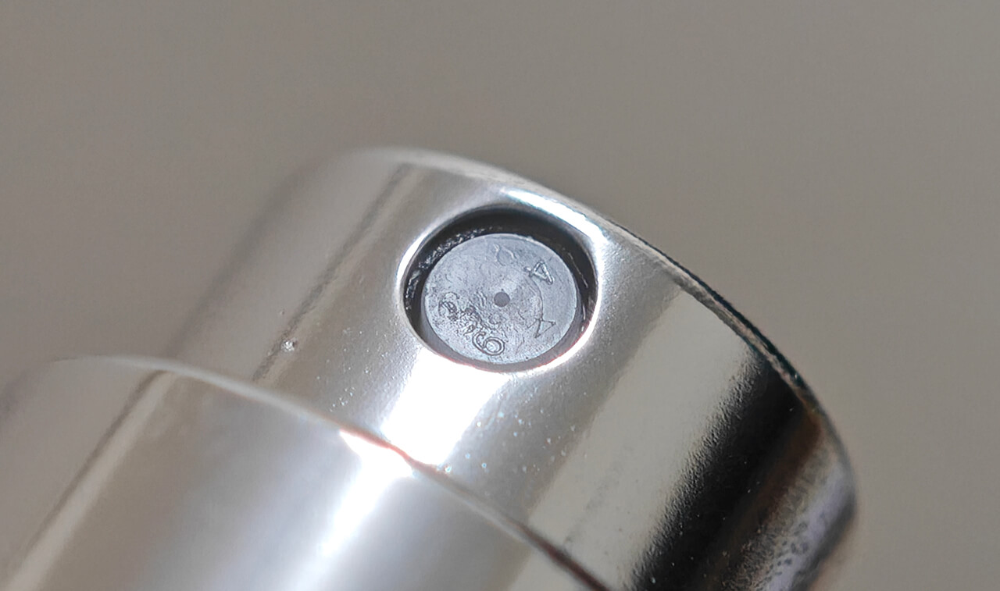
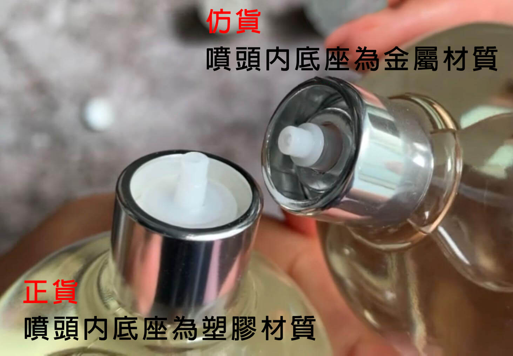
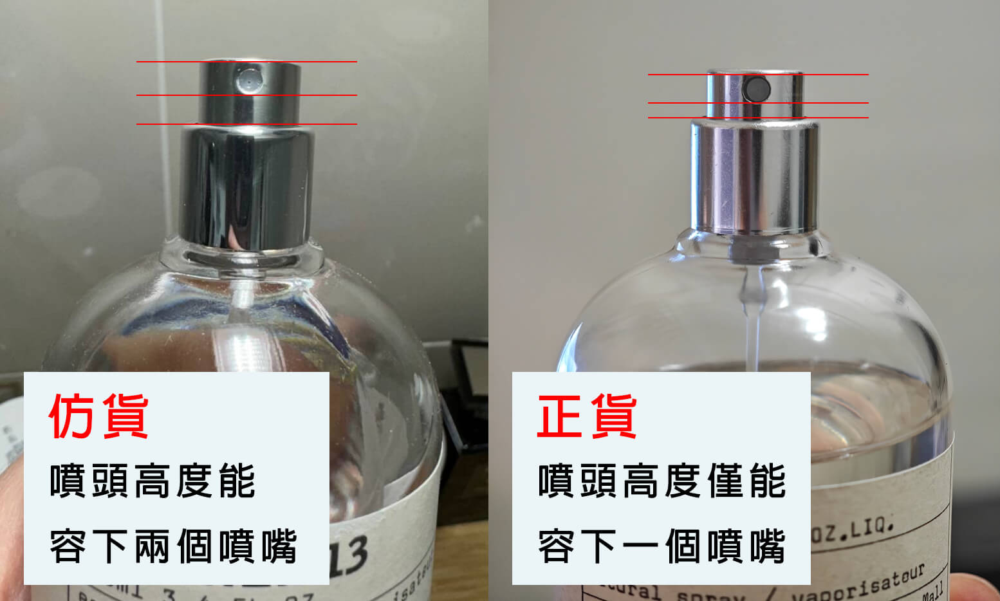

# Le Labo

--8<-- "refs.md"
--8<-- "header_warning.md"

## 瓶蓋

這個我認為並不是很準確，我手邊就有一個台北內湖 Le Labo 購買的香水，但是他的瓶蓋刻字有點像仿貨。

## 相對定價

正貨的 Le Labo 城市限定系列的價格，應該要明顯高於常態系列。

例如賣家有賣 Gaiac 10 （常被稱為 `東京 10` ），
那麼它的售價應該「明顯」（1.5 倍 ～ 2 倍）高於常態系列的價格。
如果價格和常態系列的價格一樣，那幾乎可以肯定有問題。

## 標籤顏色

標籤本身為微黃的米白色（氧化？），不反光。

## 標籤地點

- 標籤上的地點寫 Moscow 的不建議購買，仿貨的重災區。
- San Francisco 的確有正貨，但也曾是假貨的災區。

## 標籤字體

正貨的印刷不是完美的，多少會有些「破損感」。其中「,」和「.」都不是「完美」的。
字體也有些微的區別，例如正貨的「p」左上角是尖的，而圖中的仿貨是圓的。

## 紙盒材質

仿貨用爛厚紙板的話，能看到紙材的橫紋。

## 紙盒內部擺設

正貨盒內就只有兩卷黑色紙張，一張感謝狀（？），「沒有」固定用的泡棉底座。

## 紙盒盒底

標籤上的英文說明不應該延續到盒底。

※更新：我後來發現似乎不那麼準確，歐洲（德文？法文？）購買的話寫的東西也是很長，寫到盒底去了。

## 塑膠膜包裝

正貨外面「沒有」套一層熱塑膜包裝。

## 噴嘴

正貨的噴嘴為乳白色（仿貨可能是純白色），上面有寫數字但肉眼看不清楚。

## 噴頭底座

## 噴頭比例

## 參考資料

- [How to Spot a Fake Le Labo Fragrance - I got SCAMMED on Mercari!](https://www.youtube.com/watch?v=Fw7Rv6s4VZc)
- [Le Labo 香水 真假 分辦](https://attscent.com/le-labo-fake-fragrance/)
- [👹 Le Labo 香水真假分辨入門 MAYURVSF](https://www.carousell.com.hk/p/1169964502/)
