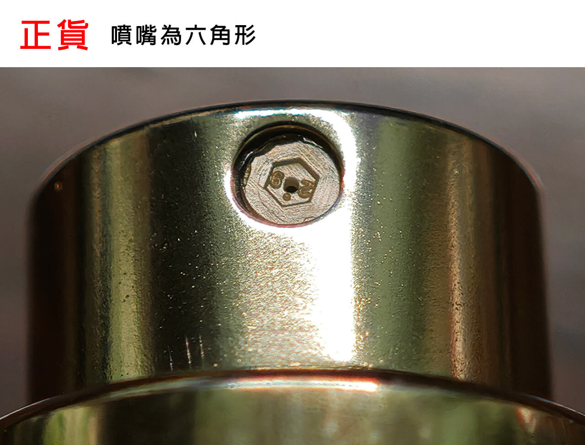
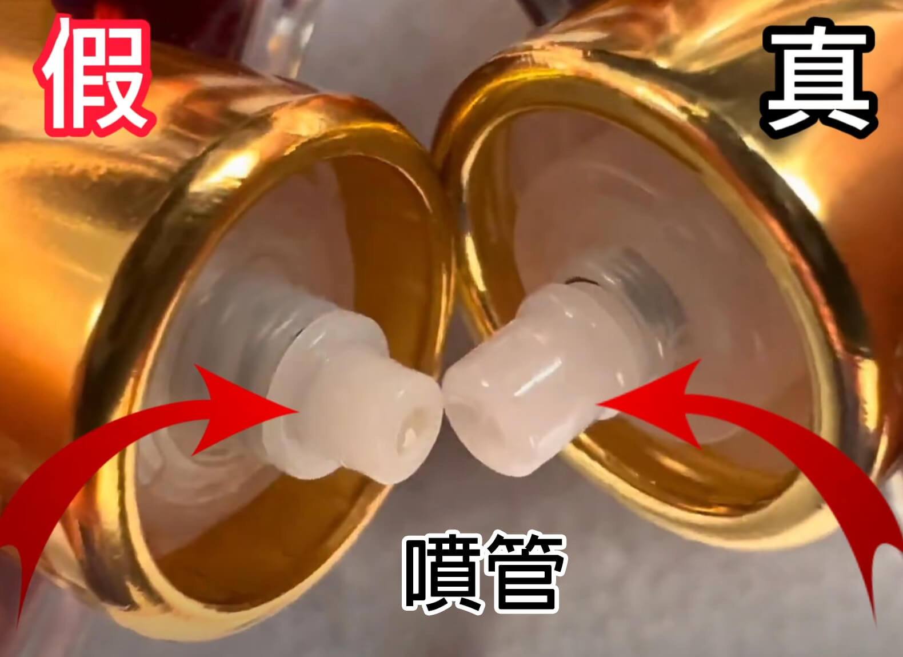
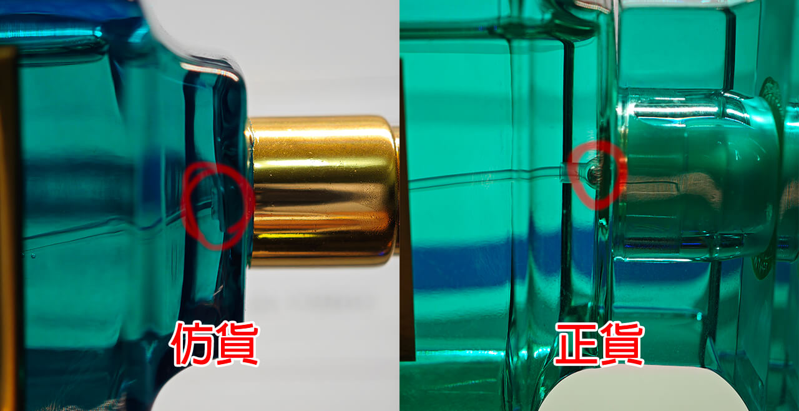
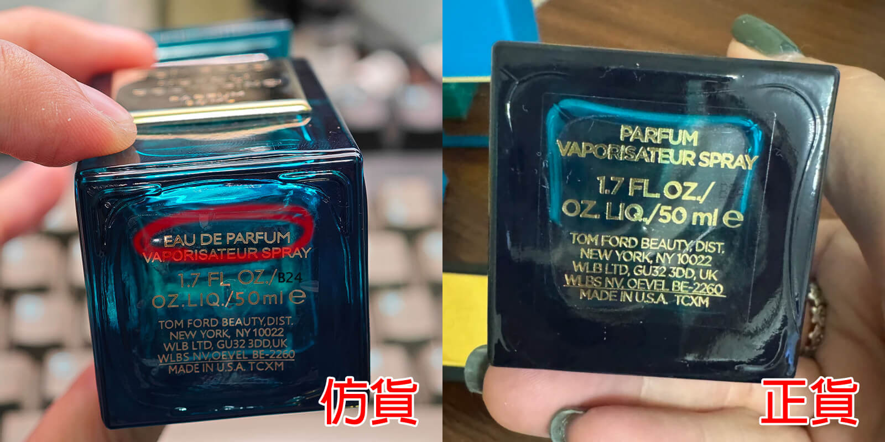
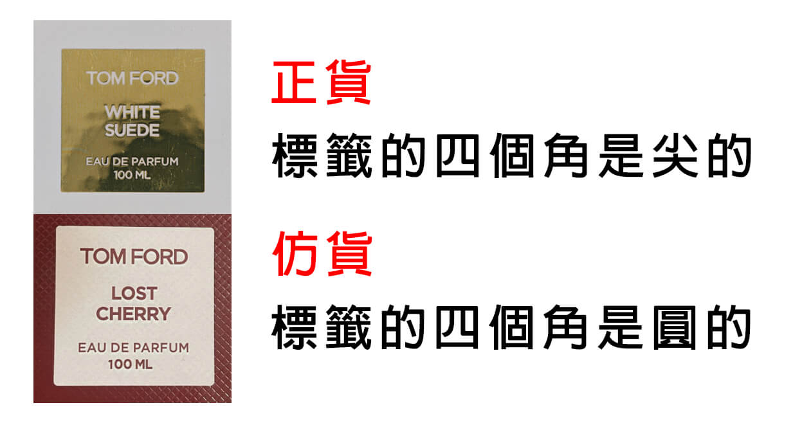
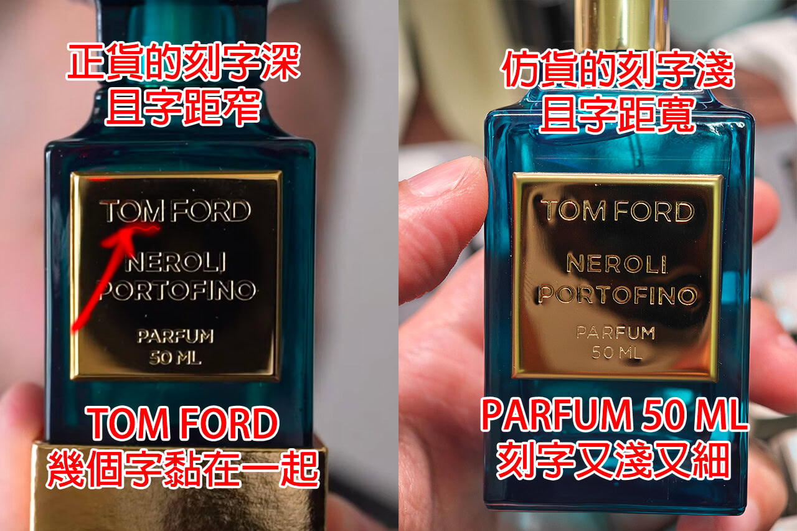
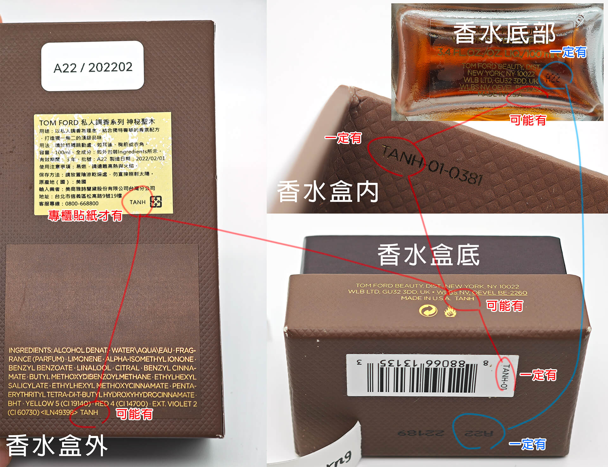

# Tom Ford 私人調香系列 (Private Blend Collection)

--8<-- "refs.md"
--8<-- "header_warning.md"

## 噴嘴形狀

正貨的噴嘴是六角形。

## 噴頭吸管

## 噴頭鋼珠

正貨的噴管與噴頭的連接處有一顆小鋼珠，仿貨可能沒有。

## 瓶底貼紙

下面這隻所仿的是暖陽橙花極致香精 (Neroli Portofino Parfum) ，
但瓶底的貼紙卻寫著淡香精 (Eau de Parfum) 而非香精 (Parfum) 。

## 貼紙標籤外觀

正貨的標籤角是尖的，有些仿貨的標籤角會比較圓。
字體也有些許不同，不過字體沒對照組的話很難看出來。

!!! info ""
    4 ML 的 Q 版香水的標籤是圓角的。

!!! question ""
    最近看到幾隻圓角標籤 Lost Cherry ，其中一隻還有貼日本專櫃標。
    但我搜了一下網路圖片，甚至國外的開箱，都是尖角的標籤 🤔

    有位[買到圓角標籤 Lost Cherry 的 YouTuber](https://youtu.be/_LoZm6brw2w?t=634)
    經過實物對照也說圓角那瓶是仿貨。

## 金屬標籤外觀

少數更高級或紀念款式的標籤是金屬的（俗稱金標、銀標）。
如果賣家和您說下圖這是工廠公差或是瑕疵品，這些都話術，其實就是仿品。

## 生產批號

正貨在產品各處的批號是一致的。

另外，批號（例如上圖中的 `A22`）可以到 [CheckFresh][] 上查詢它的製造時間。
如果製造時間早於香水首次發表的日期非常多，那也是很可疑的。

## 相對定價

在私人調香系列的淡香精中，有幾隻是相對於其他「明顯」比較貴的。包括但不限於

- Black Lacquer (寂境黑漆)
- Electric Cherry (電光櫻桃)
- Figue Érotique (情慾無花果)
- Fucking Fabulous (先聲奪人)
- Myrrhe Mystere (神秘曙光)
- Vanilla Sex (縱情香草)
- Vanille Fatale (引誘香草)

## 錯誤的容量

⚠️ TF 有可能在未來生產以前沒有的容量，所以這邊的資訊可能過時

某些私人調香的香型「沒有」 100 ML 的版本。包括但不限於

- Amber Intrigue (琥珀詭計)
- Azure Lime (沁涼萊姆)
- Black Lacquer (寂境黑漆)
- Bois Marocain (雪松秘境)
- Fougere D'Argent (經典靈感)
- Fucking Fabulous Parfum (先聲奪人 香精版)
- Neroli Portofino Parfum (暖陽橙花 香精版)
- Oud Wood Parfum (神秘東方 香精版)
- Santal Blush (忘憂聖壇)
- Soleil Neige Parfum (冬日光芒 香精版)
- Vanilla Sex (縱情香草)
- Vanille Fatale (引誘香草)

## 參考資料

- [Tom Ford 香水 真假 分辦](https://attscent.com/tom-ford-fake-fragrance/)
