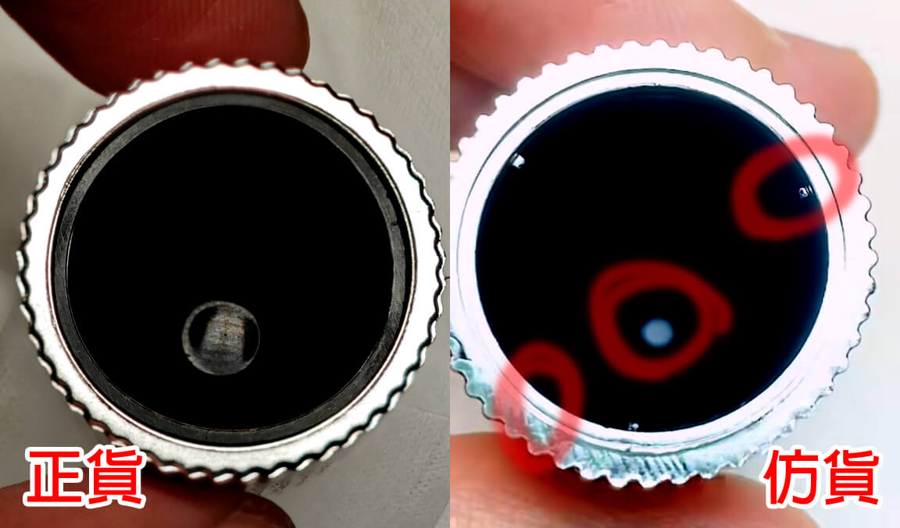
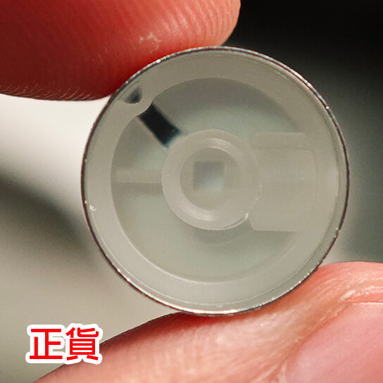
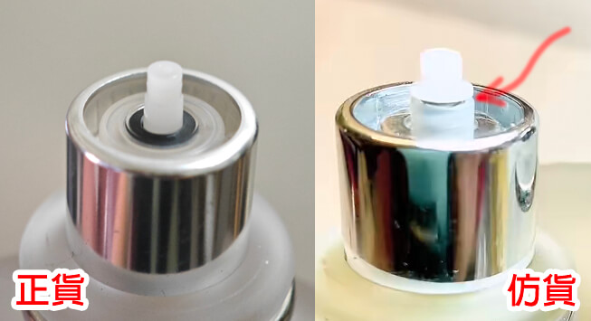
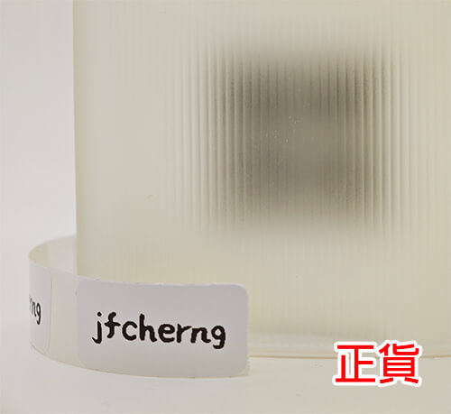

# Tom Ford Grey Vetiver

--8<-- "refs.md"
--8<-- "header_warning.md"

## 瓶蓋內部

- 正貨瓶蓋內為雙層銀白、黑色，圖中的仿貨為雙層銀白、銀白。
- 正貨的瓶蓋內底部有一個會反光的小圓形底面。
- 正貨瓶蓋內部用來固定的不是銀白色的突起物，而是黑色且延伸往瓶蓋底部的三條突起線（拍不太出來）。

## 噴嘴內部

- 正貨的噴嘴內部有兩個鏤空的小凹槽，可以從中看到外殼的銀色材質。
- 正貨的噴嘴為乳白色不透明。

## 噴嘴吸管

正貨的噴嘴裡的吸管為一體成形，仿貨的可能為分段式。

## 瓶身背面

由瓶身背面往正面看去，在正面貼金屬標籤的地方彷彿能看到四個黑色圓圈。

## 參考資料

- [tf汤姆福特香根草，如何看真假](https://v.douyin.com/ikKnV9Ub/)
