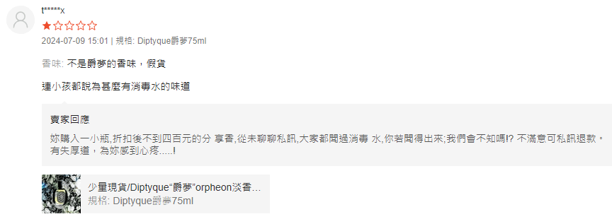
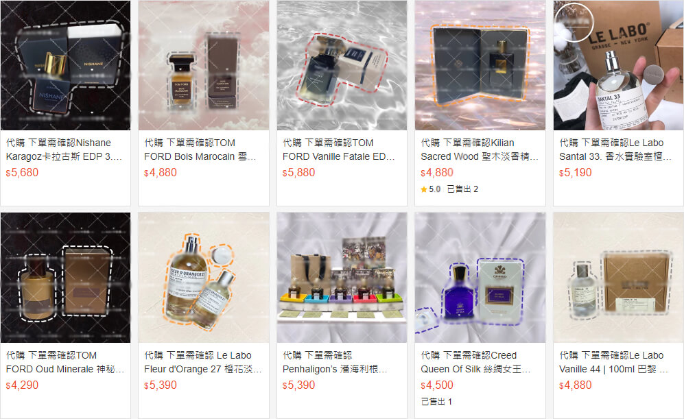
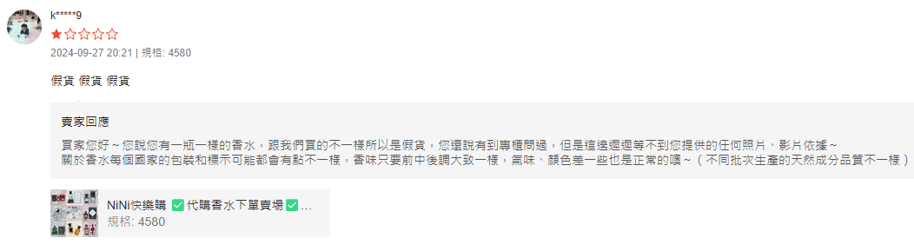
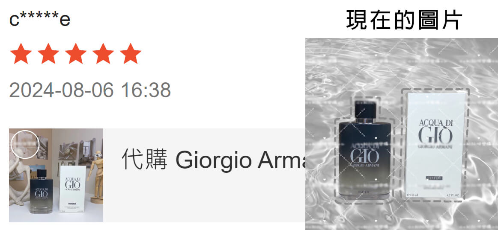
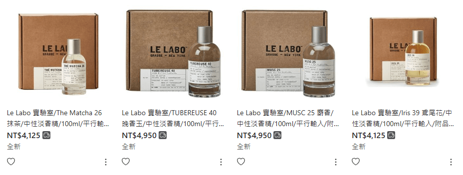
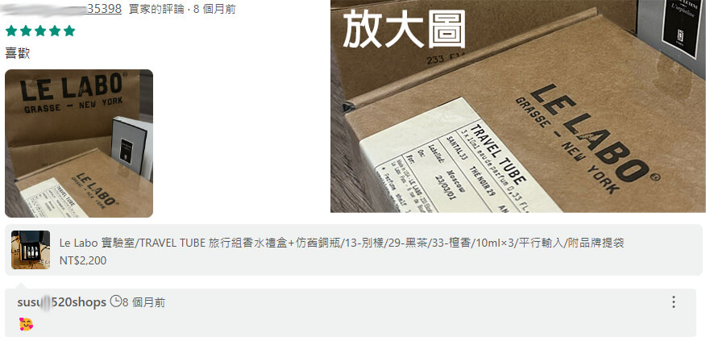
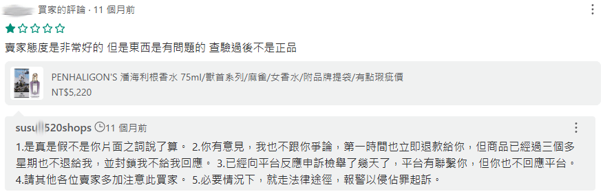
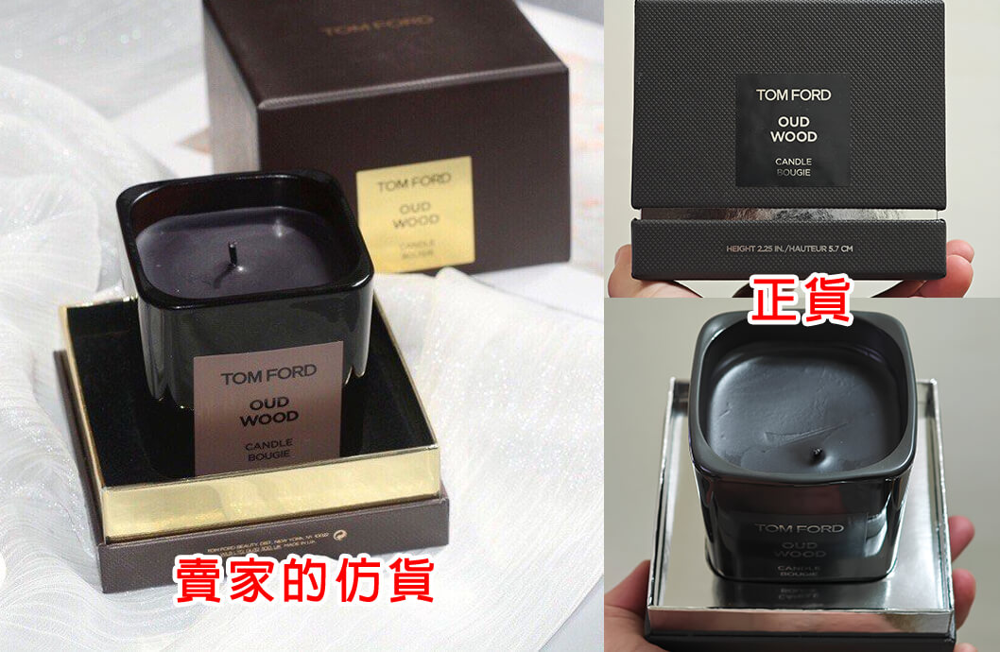

# 我認為有疑慮的賣場

以下都只是我個人覺得有疑慮，請您閱讀後自行判斷。
現在疑似賣仿貨的賣場那麼多，也不可能全數列出，這邊只列出幾個比較常出現在我眼裡的。

## 蝦皮購物 1

名稱與「瑕疵香水」有關的賣場，有很多個。這邊意思一下給個[範例](https://shopee.tw/ada98989)。

以下是他們常用的話術：

- 二手香水，僅噴一下
- 瑕疵香水
- 氣味不良品
- 瑕疵一定有，只保證味道
- 接受無理由退貨
- 很誠實地跟你說有假貨特徵

幫您翻譯一下以上幾條：我賣的是假貨。

!!! warning "警告"
    有群友說他們的針管香是正貨，但是正裝是假的。

沒什麼好說明的，正貨完全不會有他們說那些瑕疵。
理由一堆，其實就是單純仿得爛而已。
如果瑕疵是因手工製品所以有誤差或是正常使用有刮痕，那我可以理解。
但工廠流水線生產的東西，連文字的字體和噴頭用料都不一樣，那我無法理解。

## 蝦皮購物 2

- 蝦皮購物： [Mavis Shoppinp](https://shopee.tw/s222755100)
- 旋轉拍賣： [nunu8820](https://tw.carousell.com/u/nunu8820/)

這間有把營業登記放上去，根據[蝦皮的規定](https://seller.shopee.tw/edu/article/19177)其月營業額在十萬元以上。

以下為賣場的公開資訊：

- 營業人名稱： Ｆｏｕｎｄ　ｔａｔｔｏｏ創設刺青
- 地址： 新北市板橋區景星里館前東路20號11樓
- 統一編號： [60177391](https://www.twincn.com/item.aspx?no=60177391)

號稱平行輸入。看起來業績很好，賣場一星評價可以自己參考，上圖是其中一筆。
我也問過在旋轉拍賣和她買過 Le Labo 香水的人，對方確定是仿貨，最慘的是當時買到的仿貨還是接近原價的八千多元。
買家不僅被騙，也對該品牌的香水產生了錯誤的香氣印象，真的可惜。
他賣的品項也沒有到超級便宜，有的甚至是原價，實屬買到撞到。

## 蝦皮購物 3

- 蝦皮購物： [NiNi快樂購](https://shopee.tw/sunny0510)
- 旋轉拍賣： [sunny.kuo.712](https://tw.carousell.com/u/sunny.kuo.712/)
- Instagram： [ninihappygo](https://www.instagram.com/ninihappygo)

這間有把營業登記放上去，根據[蝦皮的規定](https://seller.shopee.tw/edu/article/19177)其月營業額在十萬元以上。

以下為賣場的公開資訊：

- 營業人名稱： 溡洸商行
- 負責人： 郭素貞
- 地址： 臺中市北區六合里篤行路121號12樓
- 統一編號： [80074963](https://www.twincn.com/item.aspx?no=80074963)

上圖的可疑之處：

- 右上角的 Le Labo Santal 33 圖片與仿貨源頭的用圖相同
- 右下角的 Le Labo Vanille 44 100 ML = $4880 異常便宜（官方定價約 $17000 嘿嘿不好意思今年又漲價囉）
- 我是不相信「源頭工廠外流」這種鬼話的。
- 查看賣場一星評價，有人說是仿貨。
  

其實以前她的賣場圖片都是那種仿貨源頭的風格，現在把背景的部分移除了，只留下物品的部分。
但我們仍然可以從過往買家的評價（或是賣家的 IG，上面的圖片都沒改過）看到當時商品所使用的圖片。

## 蝦皮購物 4

- 蝦皮購物： [香遇坊【分裝香水】](https://shopee.tw/biao2139)

賣場的一星評價不少可以自己看。

## 蝦皮購物 5

- 蝦皮購物： [香水圖書館](https://shopee.tw/snoopy821218)

一樣是超便宜分裝，賣場的一星評價不少可以自己看。
這間有把營業登記放上來，寫著合法登記政府立案。
已經做到要[開發票](https://seller.shopee.tw/edu/article/605)了，推測其月營業額應該在二十萬元以上。

以下為賣場的公開資訊：

- 營業人名稱：烏木工作坊
- 負責人：黃立偉
- 地址：[臺中市西屯區何源里漢成街58號1樓](https://maps.app.goo.gl/pXWptJJPoZdBqFhC8)
- 統一編號：[88613068](https://www.twincn.com/item.aspx?no=88613068)

## 蝦皮購物 6

- 蝦皮購物： [『香氣飄飄』 香水分裝 香水小樣 旅行裝 便攜式 香氛館 💯正貨](https://shopee.tw/yifang0526)

一樣是超便宜分裝，賣場的一星評價不少可以自己看。

## 旋轉拍賣 1

也有「二手瑕疵」系列的賣場，例如 https://tw.carousell.com/u/ada98989/

## 旋轉拍賣 2

!!! danger ""
    不知道是又換名字了，還是被檢舉到封鎖帳號了。

- 旋轉拍賣： [peipei520shop](https://tw.carousell.com/u/peipei520shop/) （以前叫 `susu0520shops` ）

號稱平行輸入。這間的價格已經異常便宜了，殺頭生意有人做，虧本生意無人做。
平行輸入確實是可能拿到比較便宜的價格，但不可能是像這種直接原價 1/4 賣還有得賺。
如果您覺得 4000 多元能買到 100 ML 的 Le Labo 城市限定香水，我建議再想想。
購證、專櫃提袋都是意義不大的證明，想要的話（包含仿香本體）都能非常便宜買到或仿冒。

其中一筆帶有照片的歷史評價如下。
花 $2200 元買到有塑膠包膜、標籤地點是 Moscow 的 Le Labo ，這真的很不酷 ☹️

同場加映：買家覺得不是正貨，以及該賣家的回應。

!!! info "備註"
    潘海利根的麻雀（知更鳥）是絕版香水。如果這個價格是正貨，那他真的是佛心來著。

## 旋轉拍賣 3

- 旋轉拍賣： [時尚 之家](https://tw.carousell.com/u/fashion_icon888/)

可疑點：

- 經典仿貨源頭風格的背景圖：兩隻假人、背景花瓶。
- 價格非常不合理，可以查一下 Tom Ford / Creed 等較高價沙龍香的定價。
- [Tom Ford 神秘東方的蠟燭](https://tw.carousell.com/p/1278200822/)：剛好我有一支專櫃正品，顏色和他的完全不一樣。
  當然，這支蠟燭沒有什麼因為產地不一樣或是新版舊版，所以顏色不一樣這種事情。

    
