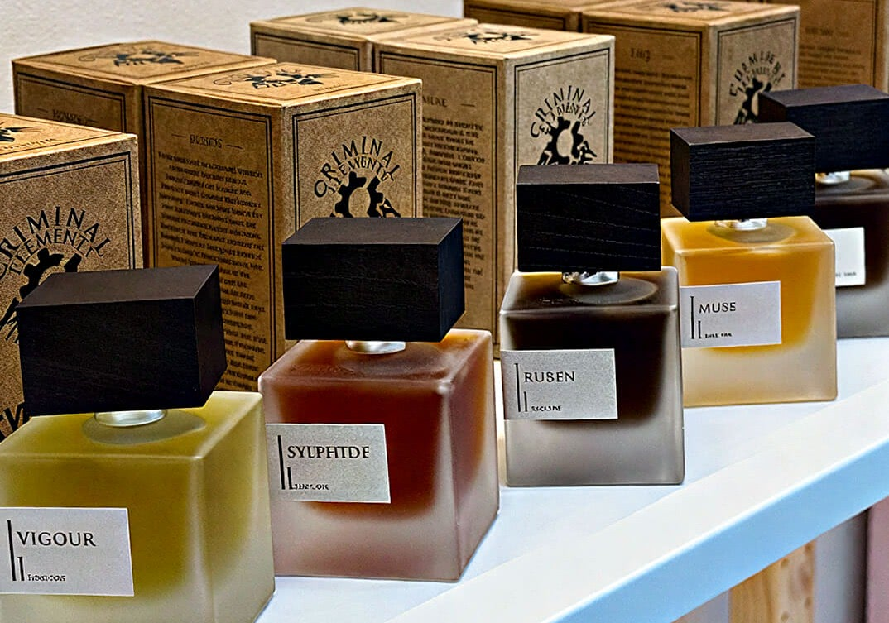

來自澳洲的小眾香水品牌。

## Fall (墜落)

【紙上】 清涼油，那個圓圓的，幾分鐘後，清涼油的熏感降下，轉向甜可樂的肉桂感，同時帶有本來的清涼。

【上皮】 跟紙上差不多，但是可樂味不多。

## Gretel (格萊特)

【紙上】 哈哈有像周黑鴨的味道，應該是零陵香豆，所以比較乾，甜口周黑鴨的，打開放了一晚上有點乾的味道，但是沒有辣味，也沒有肉味。

【上皮】 也是周黑鴨——最後是五香瓜子。

## Hansel (漢塞爾)

【紙上】 是煙燻的焚香，比較輕盈，帶有一丟丟綠，同時含有的藏紅花的氣息，但是這裡的藏紅花沒有什麼塑膠感，擴散很不錯，我只噴了一股哦，很實穿。

【上皮】 上皮會水潤點，後面會水氣，可能龍涎香的問題，有點海的味道，哈哈哈——留香很久哦。

## Masquerade (化妝舞會)

【紙上】 剛開始是果香，一時半會想不到是什麼，看了一下香表，原來是桃子，呀，桃子香氣不是那麼輕浮，是那種果肉帶有肉感，然後帶有煙燻味，有一點小甜，但是整個香氣質感做的很好，你後面能感受到桃子的慢慢的收干，整個桃子也沒有什麼花香，所以不會感覺有點母。有一些酒香在裡面，跟名字很符合，舞會嘛就是需要有酒有水果，後面煙燻木質為主。

【上皮】 煙燻感很足，然後有點皮革的臭味，慢慢的帶有的桃子的肉感，這裡的桃子，皮革的動物感重。這裡的桃子感覺溶了進去 沒有紙上那麼清透，同時甜度比紙上重。不喜歡的人會覺得臭。

## Muse (繆斯)

【紙上】 剛開始是很明顯的草本金銀花的味道，同時金銀花引出柚子的香氣，漸漸的 鳶尾的粉讓香氣有點糯糯的，讓整個香氣不那麼尖銳。整個香氣帶有金銀花的特殊氣息，也有柚子的一點青澀。鳶尾也開始柔潤的溫和。最後有點 野草根的粉香+金銀花+柚子。再後面就是柚子花了。尾調最後橙花的皂感，變化比較豐富。相比古特爾的忍冬，這個留香更久。

【上皮】 先是柚子花，然後才有柑橘橘肉出現，再次金銀花冒出。鳶尾的呈現不那麼明顯，但是你也能感受到一些油潤的粉。最後就是皂感，可能是橙花的原因吧。

## Neon (霓虹)

【紙上】 像是帶皮的橘子，有那種橘皮的油再裡面，能感受到新鮮的橘子，但是不太水。後續皮感退去就是類似泡騰片的vc的橘子味了，整個味道簡單但又有趣。

【上皮】 橘皮感更明顯點，彷彿你在聞一片剝開的橘子皮。慢慢過去到橘子肉，後面的走向和紙上差不多了，也是泡騰片的vc橘子味了。

## Queer (酷兒)

【紙上】 這個說裡面有桂花，我來聞聞，剛開始很淡，帶有淡淡的皮革味，慢慢浮現出蘋果味，是蘋果皮的清香，裡面的甜帶有一點黑加侖的果甜，桂花嘛，我們中國的桂花味我是沒有感覺出，但是老外喜歡的那種桂花味是在的，整體就是蘋果淡皮革。有點像乾枯失去水分的蘋果。

【上皮】 甜蘋果帶有點蜂蜜又有一些煙燻的皮革感，不喜歡皮革的可能覺得有點臭，裡面的甜像是醃漬果醬的厚重的甜，但是甜度不算高。有點像那種煙燻烤蘋果，失去些水分的蘋果，上面刷上一層蜂蜜。

## Ruben (魯本)

【紙上】 很熟悉的薰衣草，是那種有點新鮮的薰衣草，可能因為裡面有點橙花的原因，讓薰衣草新鮮的起來，同時帶有檸檬的香氣在裡面。最後以薰衣草為主。

【上皮】 那種抹開的薰衣草精油柔和的香氣，同時橙花帶來了一點皂感，最後就是那種乾燥的薰衣草油了。沒紙上好聞。

## Sanguinem Harena (血與沙)

【紙上】 一點蜂蜜的甜+鐵鏽血腥的味道，帶有一點藥草。整個味道比較淡一點草本+一點甜的蜂蜜。

【上皮】 跟紙上差不多，但是表現力沒有紙上好，血漿味，要做不做，要濕不濕的再來一點蜂蜜的味。

## Sylphide (精靈舞者)

【紙上】 像是一個新的相機的味道，帶有一點焦乾的蜂蜜。

【上皮】 也是那種味，應該是那個安脂點味，有一點乾乾的甜，哎呀，但是沒有什麼記憶點。

## Tobacco Jam (菸草果醬)

【紙上】 很明顯的乾的菸草絲的味道，有點像手搓菸草，我不知道你們記得小時候那種手工菸草葉，就是那個味，然後帶有一點甜的果醬味，菸草混合果醬，果醬是不加糖的那種帶有一些酸甜。

【上皮】 搓了很久的菸絲，有點厚重，然後再有蜂蜜的甜加入，蜂蜜的甜開始融合進菸草，讓菸草沒有一開始那麼厚重，巧妙的讓氣味略有清透，同時甜感開始有果香的酸甜，菸草果醬。

## Verge (邊緣)

【紙上】 清新的綠葉亞麻+檸檬的清新，帶有一點番茄葉，番茄葉沒有那麼生腥，同時含有帶有橘子肉的小甜，因為有綠葉亞麻味壓制著甜，最後以亞麻味為主導。

【上皮】 漿果帶有些甜，這裡的漿果有點像那種沒有特別成熟的番茄的漿果，然後含有一絲番茄葉+亞麻的綠意，這裡的甜是有點砂糖的甜，漸漸的亞麻的綠意比例增多，糖度會降低些

## Vigour (活力)

【紙上】 有點綠意的，比較清新，你能聞到香根草那種木根味，但是沒有泥土味，有柔和的檸檬穿插，讓香根草新鮮了起來，彷彿你剛挖出來的一樣，香氣柔和攻擊性不強，有一點點的薰衣草點綴，同時帶有一些類似風油精的熏感，整個屬於舒適的溫柔的香根草，非常實穿。

【上皮】 上皮會臭一點，有點動物味，然後才會有帶有點土味的香根草

## Wicked Mistress (蛇蠍情人)

【紙上】 荔枝糖，真的，好味的，也挺像草莓的，就是草莓糖，不是新鮮那種。後面甜度會降低點，酸甜。

【上皮】 沒有什麼荔枝糖味，草莓味比較突出，而且能感受到新鮮的草莓帶有點點草莓綠感，然後再轉向草莓糖，酸甜可口，最後甜度降低，帶來一點乾燥的玫瑰。

## 資料來源

- http://xhslink.com/o/7eGUg1W91Af
- http://xhslink.com/o/3DwhxAGyI24
- http://xhslink.com/o/4Pha3yu8tXE
- http://xhslink.com/o/1WjCuo7xtJG
